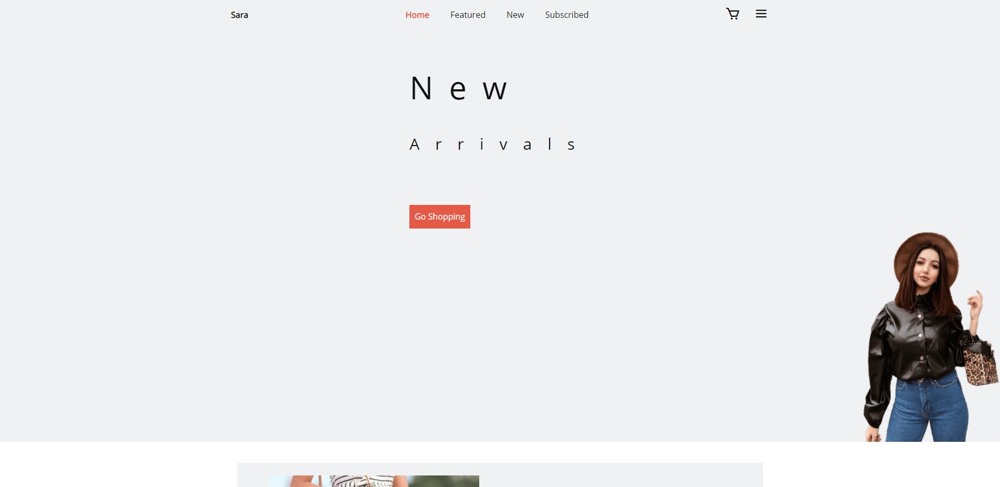

# Sara E-commerce Website
This is a test project for a fashion e-commerce website.



## Built With
- HTML5
- SASS
- JS

## Requirements
 - NPM
 - Gulp.js

## Install
```
    $ git clone git@github>>>>> main
    $ cd main
    $ npm install
```

## Running the project
Production directory is the `public` folder.\
\
Run a full build
```
gulp all
```
Watch files and run BrowserSync
```
gulp serve
```
### Individual Tasks
These tasks can be run individually.\
\
Include HTML partials
```
gulp html
```
Compile SASS, browser autoprefix and minify CSS
```
gulp style
```
Compile and minify JS
```
gulp js
```
Minify images
```
gulp image
```

## Contributors
- Favour Samuel (@samiiexx)